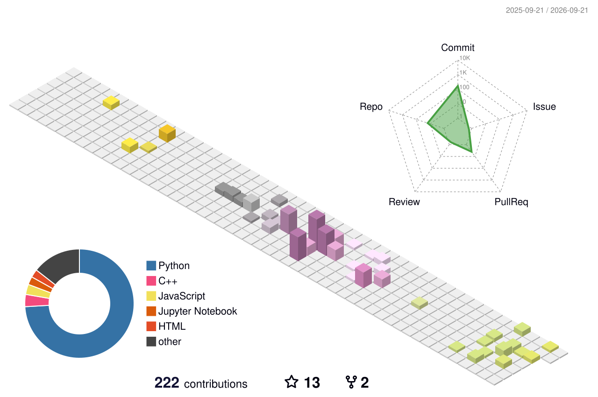

<div align="center">
  
</div>

<div align="center">
  <sub><b>physical asset:</b> one researcher &nbsp;·&nbsp; <b>virtual asset:</b> this page &nbsp;·&nbsp; <b>sync interval:</b> whenever I remember to push</sub>
</div>

<br>

My PhD: virtual models that watched a real system, learned its habits, and then told you what it was about to do. At the time, the system was a photovoltaic solar array, and the question was how much cleaner energy we could pull out of it before the sun went down. Previously, I had worked on military simulators, city blocks, rivers, and a forest.


---

## ◤ Live state

```yaml
twin_id:      madara.premawardhana
status:       RUNNING                     # no unplanned downtime since 1994
site:         Buckingham, UK  ←  Moratuwa, LK
model:        PhD Computing, University of Buckingham
domain:       digital twins for photovoltaic solar
objective:    minimise(kWh_wasted) subject to net_zero
solver:       stubbornness + a large amount of tea
```

## ◤ Subsystems

```text
  SUBSYSTEM             STATE        LAST TELEMETRY
  ────────────────────────────────────────────────────────────────────────
  research.solar_dt     RUNNING      irradiance models, PV yield, Net-Zero
  sim.unreal            HOT          urban twins, EdMode plugins, terrain
  ml.pipeline           TRAINING     tree health, precipitation, forecasting
  geo.stack             STABLE       GeoServer, hydrology, waterway modelling
  outreach.stem         BROADCAST    Soapbox Science, talks, mentoring
  awards.listener       BOUND        Tomorrow's Leader @ Overt STEM 2025
                                     BCS HEQ 2016 — worldwide top candidate
  sleep.daemon          KILLED       known issue · will not fix
```

## ◤ Instrumentation

I care much more about whether the model matches reality than about which language it was written in, but for the record:

|                    |                                                                        |
| ------------------ | ---------------------------------------------------------------------- |
| **Simulate**       | `Unreal Engine` `C++` `Blueprints` `Cesium` `digital twin frameworks`  |
| **Model & learn**  | `Python` `PyTorch` `scikit-learn` `pandas` `computer vision`           |
| **Ground truth**   | `IoT sensing` `GeoServer` `GIS` `remote sensing` `hydrological data`   |
| **Ship**           | `Git` `Docker` `automation tooling` `whatever the deadline requires`   |

## ◤ Twinned systems

Selected work. Each one started as a real thing, and ended as a thing you can run.

| System | What it does |
| ------ | ------------ |
| [**Photovoltaic Solar Digital Twin**](https://madarapremawardana.wixsite.com/profile/portfolio-collections/portfolio/photovoltaic-solar-digital-twin) | The core of the PhD. A virtual solar installation that simulates environmental conditions and optimises output. |
| [**ArborScan**](https://madarapremawardana.wixsite.com/profile/portfolio-collections/portfolio/arborscan) | Reads trees. Scanning and analysis for canopy and health assessment. |
| [**LocSim**](https://github.com/MadaraPremawardhana/LocSim) | Unreal-based location digital twin. Real place in, navigable simulation out. |
| [**Unreal EdMode ML Plugin**](https://madarapremawardana.wixsite.com/profile/portfolio-collections/portfolio/unreal-engine-edmode-plugin-for-ml-capabilities) | Drops machine learning into the Unreal editor itself, so the model lives next to the scene it is reasoning about. |
| [**WeatherSim**](https://madarapremawardana.wixsite.com/profile/portfolio-collections/portfolio/weathersim) | Weather, simulated. Because a solar twin with a permanently clear sky is a liar. |
| [**Sri Lanka — Waterways**](https://madarapremawardana.wixsite.com/profile/portfolio-collections/portfolio/sri-lanka-waterways) | Mapping and modelling the rivers I grew up beside. |
| [**Terrain Generation Automation**](https://madarapremawardana.wixsite.com/profile/portfolio-collections/portfolio/terrain-generation-automation-tool) | Turns hours of manual landscape building into a script and a coffee break. |

**Papers and reviews:** [Digital Twins as a Framework for IoT Applications](https://madarapremawardana.wixsite.com/profile/portfolio-collections/portfolio/digital-twins-as-a-framework-for-iot-applications) · [On the Impact of Temperature for Precipitation Analysis](https://madarapremawardana.wixsite.com/profile/portfolio-collections/portfolio/on-the-impact-of-temperature-for-precipitation-analysis) · [Humanoid Robot Fingers: A Review](https://madarapremawardana.wixsite.com/profile/portfolio-collections/portfolio/humanoid-robot-fingers-a-review)

→ [**Full portfolio**](https://madarapremawardana.wixsite.com/profile/portfolio) · 39 repositories and counting

## ◤ Contribution field, in three dimensions

Flat charts are a projection. Here is the actual terrain.

<div align="center">
  <picture>
    <source media="(prefers-color-scheme: dark)" srcset="./profile-3d-contrib/profile-night-rainbow.svg">
    <source media="(prefers-color-scheme: light)" srcset="./profile-3d-contrib/profile-season-animate.svg">
    
  </picture>
</div>

## ◤ Beyond the lab

I talk about science to people who did not sign up for a lecture: Soapbox Science, public events, schools, and anyone who asks a good question at the wrong moment. STEM should be legible and it should be open to people who do not currently see themselves in it. I mentor because someone once did that for me.

## ◤ Uplink

<div align="center">

[**Portfolio**](https://madarapremawardana.wixsite.com/profile/portfolio) &nbsp;·&nbsp;
[**LinkedIn**](https://www.linkedin.com/in/madarapremawardana) &nbsp;·&nbsp;
[**Email**](mailto:madarapremawardana@gmail.com?subject=Hello%20Madara)

<sub>Open to research collaboration, digital twin work, and speaking invitations.</sub>

</div>

---

<div align="center">
  <sub><code>END OF TELEMETRY</code> · this twin is a simplification · for the full-fidelity version, send an email</sub>
</div>
